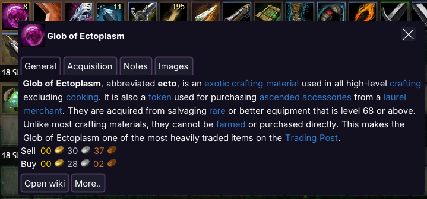
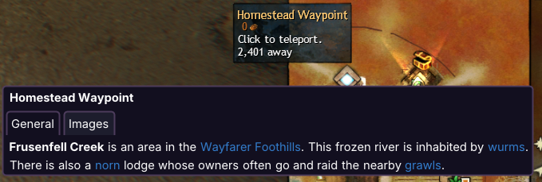

# Item detail popups
Item detail popups for Nexus (Guild Wars 2 addon manager).

## Features
- Get information from wikipedia about item description, notes, acquisition and more.
- Open popups on hovered item or by typing search phrase manually.
- Manually type and search for articles on wiki.
- Quickly check prices of items on the trading post.
- POE2-inspired, interactable popup system which allows browsing subsequent wiki pages for information.
- Designed for speed, with caching mechanisms to improve speed and reduce data usage.

## Disclaimer
This addon uses **macros** (virtual key-presses) to get item chat link from chatbox. Refer to [macro policy](https://help.guildwars2.com/hc/en-us/articles/360013762153-Policy-Macros-and-Macro-Use) for more details about macro usage.

## Installation
1. Install the [Nexus](https://github.com/RaidcoreGG/Nexus) addon manager ([website](https://raidcore.gg/Nexus)).
2. Download [`item_detail_popups.dll`](../../releases/latest) and place it in your `addons` folder (e.g. `C:\Program Files\Guild Wars 2\addons`).
3. Open the Nexus addon window, click on the refresh button if necessary and load Item detail popups.

## Screenshots & Usage
### From inventory
Hover over item in the inventory and press a keybind (default CTRL+SHIFT+X).

### From crafting window
Hover over item name on the crafting list and press a keybind.

### From trading post
Hover over an item on the trading post and press a keybind.

### From minimap
Hover over a minimap waypoint or point of interest and press a keybind.

### Custom search
Press a custom search keybind (default CTRL+SHIFT+F) and enter a search phrase to search an article on wiki.

## Solving common problems
1. Popup doesn't open (loading spinner dissapears)
    - Make sure english in-game language is used. Other languages are not supported.
    - In case of using an uncommon keyboard layout, try changing the layout in advanced settings.
    - Try increasing macro delay in advanced settings.

## Reporting issues
In case of any further problems or feature requests, please raise them in one of following ways:
- On github,
- Message me in game (lorkano.4609),
- Use [discord channel](https://discord.com/channels/410828272679518241/1321117612209602601).

## Credits
- to https://raidcore.gg/, for developing Nexus,
- to [Zerthox](https://github.com/zerthox), for nexus and mumble rust bindings,
- creator of https://github.com/droundy/singularize, for creating a simple singularize library.
